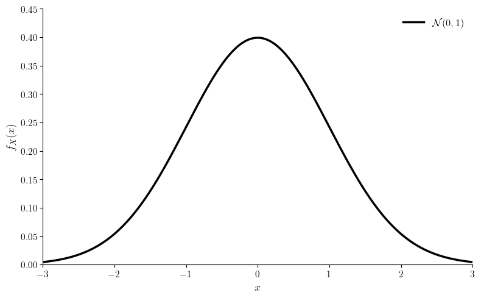
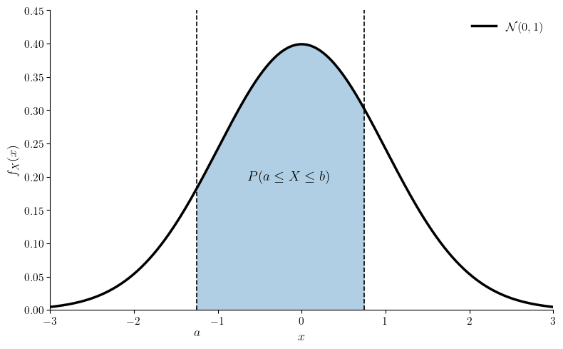

# **The Normal Distribution**
Last Edited: 09/08/2026

### 1. Introduction

In the law few sections, we saw that a binomially distributed variable $X \sim \text{Bi} (n, p)$ becomes Poisson distributed in the limit $n \rightarrow \infty$ with small $p$. Although we will not show it in this section, it turns out that if $p$ (the probability of success) is not small, $X$ tends to the **normal distribution**. The visual shape of the normal distribution is well known and it often described as a _"bell-curve"_.

A variable $X$ that is normally distributed is denoted as $X \sim \mathcal{N} (\mu, \sigma^2)$ where the distribution parameters are the mean $\text{E}[X] = \mu$ and the variance $\text{Var}[X]= \sigma^2$. Note that unlike a binomially distributed variable, $X$ is a continuous random variable and has the following probability density function, 

$$
\boxed{ f_X(x) = \frac{1}{\sigma \sqrt{2 \pi}}e^{\frac{(x - \mu)^2}{2\sigma^2}} }
$$

The probability that random variable $X$ takes on a value between $a$ and $b$ where $b > a$ is then, 

$$
\text{P}(a \geq x \geq b) =  \int_{a}^{b} f_X(x) dx = \frac{1}{\sigma \sqrt{2 \pi}} \int_{a}^{b} e^{\frac{(x - \mu)^2}{2\sigma^2}} dx
$$

Graphically, 

